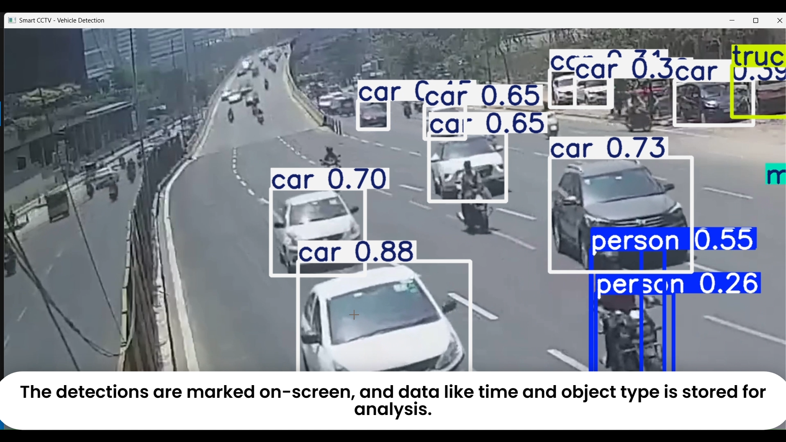
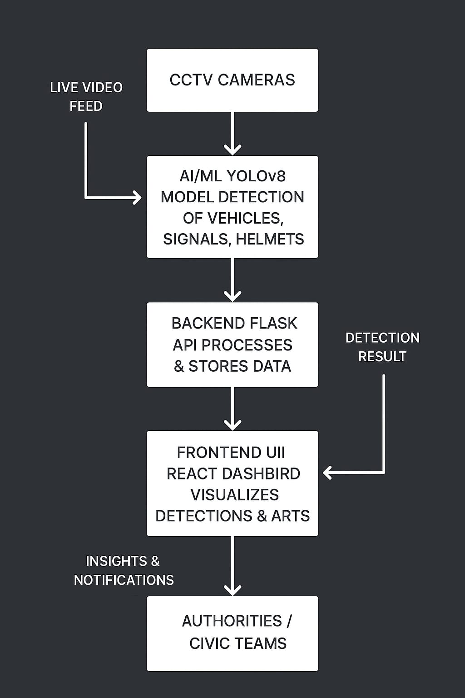

# 🛰️ Smart Multimodal AI CCTV Monitoring System

A cutting-edge AI system that monitors live CCTV feeds (video + audio) to detect traffic violations, crimes, civic issues, and emergencies in real-time, and automatically reports them to authorities with evidence.


##  Project Goal

The goal of this project is to create a **smart, autonomous surveillance system** that can:

1. Reduce road accidents by detecting traffic violations.
2. Enhance public safety by identifying crimes and hazards.
3. Monitor civic infrastructure and detect issues like garbage piles, road damage, or roadblocks.
4. Provide real-time emergency detection with audio cues such as sirens.
5. Automatically alert authorities with **timestamped evidence** for faster response.


##  Features that we are currently working on

* **Traffic Monitoring**

  * Detect vehicles moving in the wrong direction.
  * Detect signal jumping and traffic violations.
  * Identify two-wheeler riders without helmets.
  * 


* **Crime & Hazard Detection**

  * Detect fights, thefts, fires, or explosions.
  * Alert authorities immediately with location and video evidence.

* **Civic Issue Monitoring**

  * Detect roadblocks, potholes, damaged roads, or garbage piles.
  * Support city maintenance and quick resolution of civic issues.

* **Emergency Detection**

  * Detect accidents, siren sounds, or unusual events.
  * Trigger instant notifications for emergency services.

* **Automated Reporting**

  * Generate alerts with video snapshots.
  * Include timestamp and exact location (if integrated with GPS-enabled cameras).

* **Dashboard (Optional)**

  * Real-time live feed monitoring.
  * Analytics for incidents detected over time.


## Tech Stack
Computer Vision: OpenCV, YOLOv8, Detectron2
Audio Analysis: PyTorch, torchaudio, librosa
AI/ML Models: PyTorch, TensorFlow
In future we will do Backend/API: Python, Flask, FastAPI
In future we will do Database: PostgreSQL / MongoDB (for logs & incident storage)
In future we will do Realtime Streaming: OpenCV VideoCapture, FFmpeg, WebSockets
In future we will do Frontend Dashboard (optional): React.js, Tailwind CSS


## 🏗️ Architecture & Workflow that we are working on



1. **Video & Audio Capture**
   Live feeds from CCTV cameras are streamed to the AI backend.

2. **AI Processing**

   * **Video:** Object detection (vehicles, people, helmets, fire, road damage).
   * **Audio:** Sound classification (siren, explosion, fire alarm, fight).

3. **Incident Analysis**
   The system identifies specific events (traffic violations, crimes, civic issues, emergencies) in real-time.

4. **Automated Reporting**

   * Stores snapshots and logs in a database.
   * Sends notifications or alerts to authorities via email/SMS/Push API.

5. **Dashboard Visualization** *(Optional)*

   * Monitor incidents, live feed, and historical data.

---

## 💡 Installation

1. Clone the repository:

```bash
git clone https://github.com/yourusername/multimodal-cctv-ai.git
cd multimodal-cctv-ai
```

2. Create a virtual environment:

```bash
python -m venv venv
source venv/bin/activate  # Linux / Mac
venv\Scripts\activate     # Windows
```

3. Install dependencies:

```bash
pip install -r requirements.txt
```

4. Run the backend server:

```bash
python backend/app.py
```

5. Access the dashboard (if implemented):

```text
http://localhost:5000
```

---

## 📝 Future Improvements

* Integrate with **IoT-enabled cameras** for GPS location.
* Add **multi-camera support** for city-wide monitoring.
* Implement **automatic incident prioritization** based on severity.
* Support **edge deployment** to process feeds locally on CCTV devices.
* Add **real-time SMS/email notifications** for authorities
